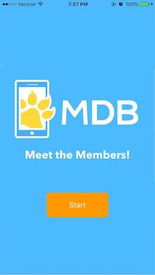

# Match the Members!

The purpose: An app to teach us the basics of XCode as well as learn the names of all active MDB members.

Features included: 
* Randomly picks member as well as answer choices (with correct answer present)
* When user selects answer, highlights green for correct and red for incorrect
* For each correct, game keeps track of score as well as longest streak
* There is a timer that only allows 5 seconds max for each member
* User can go to stats screen to see streak, score, and last three answers (if they exist)

